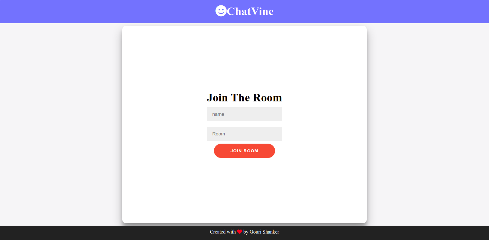
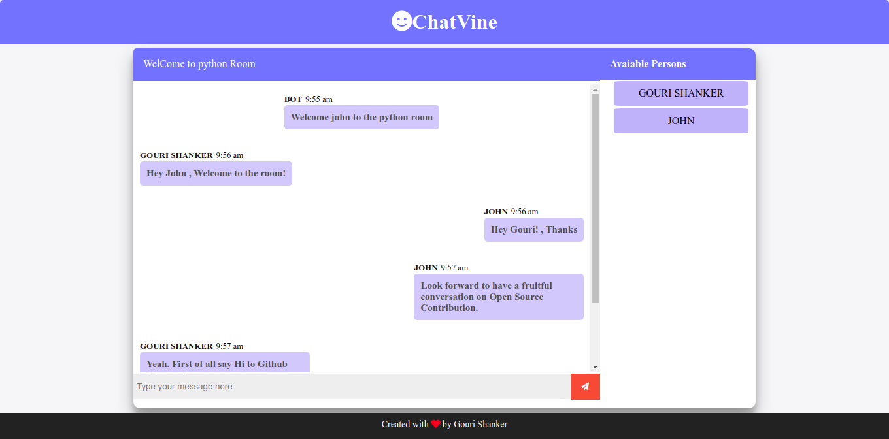

# Simple Chat App with geckos.io

## About

This example uses [@socket.io/server](https://www.npmjs.com/package/socket.io) (4.2.0) on the node server and [@socket.io/client](https://www.npmjs.com/package/socket.io-client) (4.2.0) on the client side.

## Preview

    

    

## Features

    1. Users can create different rooms and chat.
    2.

## How To Start

To clone and run this example, you'll need [Git](https://git-scm.com) and [Node.js](https://nodejs.org/en/download/) (which comes with [npm](http://npmjs.com)) installed on your computer. From your command line:

```bash
# Clone this repository
$ git clone --depth 1 https://github.com/gourishankerJK/CHATAPP.git

# Go into the repository
$ cd server

# Install dependencies
$ npm install

#Run the server
$ node server.js

$ cd client

$ npm install
# Start the the app
$ npm start

# Done
# Now open your browser on http://localhost:3000
```
